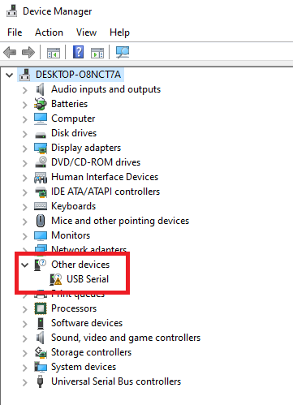
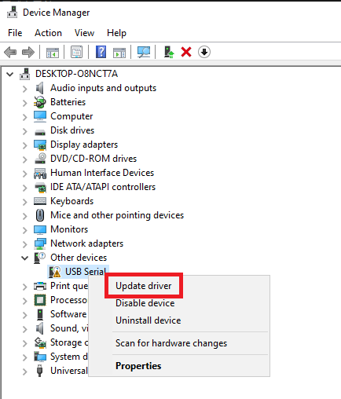
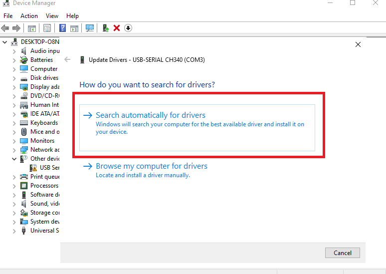
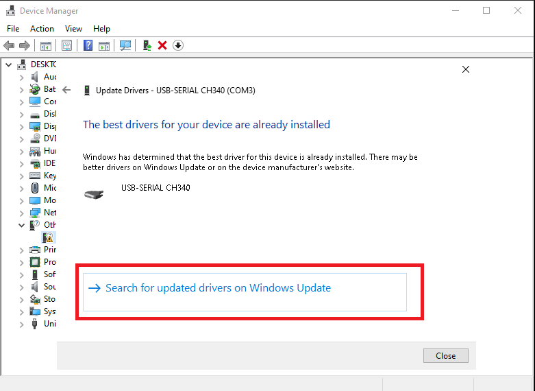
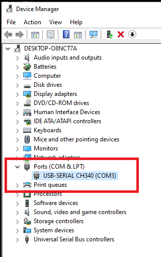

# What is this project?
This project is based on the famous [libnfc](https://github.com/nfc-tools/libnfc) project as the backend to drive the NXP PN532 chip. Much of the higher-level application code is based on the [mfoc-hardnested](https://github.com/nfc-tools/mfoc-hardnested) project.
The aim of this project is to make reading/writing MIFARE Classic, MIFARE Ultralight, as well as an NTAG tags easier on Windows and Mac.
I only plan to support PN532 via a UART to USB interface as this is the most cost-effective way to read/write a tag. 
The compiled application has only one binary file which makes the application portable.

# Supported hardware

Only NXP PN532 via UART to USB interface is supported. The PN532 boards are widely available from all the major online retailers. If you buy one of the boards without a USB port, you will need to buy a UART to USB cable as well (also available via all major online retailers). I also have the PN532 boards with a CH340 UART to USB interface built-in for sale. The PN532 boards I carry have USB-C ports on them. Please note, the widely available ACR122 reader is not supported due to ACR122 does not use UART to USB interface.

# Supported operating system

Only Windows and Mac (under development) are supported. There's no plan to support Linux. For Linux applications, you can use [libnfc](https://github.com/nfc-tools/libnfc) directly.

# Supported RFID tags
## Read
MIFARE Classic, MIFARE Ultralight (under development), NTAG (under development)
## Write
Gen 2 and Gen 3 Magic MIFARE Classic, Magic MIFARE Ultralight (under development).

# Usage
## Reader driver installation
If you purchased a driver from me, Windows should already have the driver for the reader. Just plug in the reader into the PC, wait for a minute or 2, the correct driver should gets installed automatically. If the driver is not installed correctly, you can open the Device Manager and install the driver with the following instruction:







## How to clone a tag
Plug in the driver, run the application and follow the instruction on the screen

# Build instruction

## Windows

Only MSYS2 environment is supported. Install MSYS2. Open the MinGW-w64 terminal, clone this project first:
```
git clone https://github.com/jumpycalm/pn532-cloner.git
```
Navigate into the project folder, create a new folder called `build`, go to that folder, use the CMake to generate the Makefile, then build the project with mingw32-make
```
cd pn532-cloner
mkdir build
cd build
cmake -G "MinGW Makefiles" ../src
mingw32-make
```
After the software is built, a PN532-Cloner.exe file should be generated. Just double click on this application and run it.


## MacOS

To be supported soon

# License

Because source code from [mfoc-hardnested](https://github.com/nfc-tools/mfoc-hardnested) project is used. [mfoc-hardnested](https://github.com/nfc-tools/mfoc-hardnested) project under GPL-2.0 License. This project must be under GPL license to comply with the [mfoc-hardnested](https://github.com/nfc-tools/mfoc-hardnested) project.

# Support this project:

Contribute code change to this project to make this project better

Buy a PN532 board with a USB-C port from me

Buy the blank magic tags from me

# Proprietary Notes
FeliCa is a registered trademark of the Sony Corporation. MIFARE is a trademark of NXP Semiconductors. Jewel Topaz is a trademark of Innovision Research & Technology. All other trademarks are the property of their respective owners.
