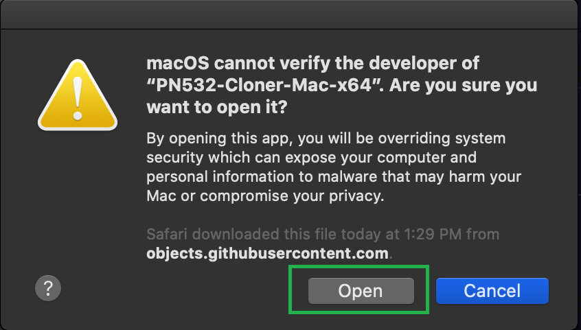

# What is this project?

This project is based on the famous [libnfc](https://github.com/nfc-tools/libnfc) project as the backend to drive the NXP PN532 chip. Much of the higher-level application code is based on the [mfoc-hardnested](https://github.com/nfc-tools/mfoc-hardnested) project.

The aim of this project is to provide a cost-effective way to make duplicating MIFARE Classic, MIFARE Ultralight, as well as NTAG tags easy on Windows and macOS.

# Supported hardware

Only NXP PN532 board via UART to USB interface is supported. The PN532 boards are widely available from all the major online retailers. If you buy one of the boards without a USB port, you will need to buy a UART to USB cable as well (also available via all major online retailers). I also have the PN532 boards with a CH340 UART to USB interface built-in for sale. The PN532 boards I carry have USB-C ports on them. Please note, the widely available ACR122 reader is not supported due to ACR122 does not use UART to USB interface.

# Supported operating system

Only Windows and macOS are supported. There's no plan to support Linux. For Linux applications, you can use [libnfc](https://github.com/nfc-tools/libnfc) directly.

# Supported RFID tags
## Read
MIFARE Classic, MIFARE Ultralight (under development), NTAG (under development).
## Write
Gen 3 Magic MIFARE Classic, Gen 2 Magic MIFARE Classic, Magic MIFARE Ultralight (under development).

# Usage
## Reader driver installation (Windows)
If you purchased a driver from me, Windows should already have the driver for the reader. Just plug the reader into the PC, wait for a minute or 2, the correct driver should get installed automatically. If the driver is not installed correctly, you can open the Device Manager and install the driver with the following instruction:


If the above method does not work (this is usually due to you are running a old version of Windows), the driver can be found in this repository or search "CH340 driver" on the internet.

## Reader driver installation (macOS)
The reader is plug-n-play on macOS. No need to install any driver.

## How to clone a tag
Plug the reader into the PC, run the application and follow the instruction on the screen. Simply read the original tag, after the read is complete, write the data onto a Magic tag (a special changeable tag). Please note, the MIFARE Classic tags are encrypted tags, it takes time to crack the keys and read the tag. The application will provide you with an ETA when you start to read a tag.

I have included the built binary files in the [Releases](https://github.com/jumpycalm/pn532-cloner/releases) section for your convenience. Below is the screenshot of the application


### Fix macOS "cannot be opened" error
macOS has secure measurement to make a user run our application harder. If you are getting the following error message, you will have to go to the System Preferences -> Security & Privacy. Click on "Click the lock to make changes", enter your password, then click on OK on the error message. After that, you should be able to see the option to be able to run the application. I have included screenshot with step by step instruction below.
If you have concern the safety of running the application, you can inspect every line of source code and build the application from the source (instruction below).




# Build instruction

## Windows

### MSYS2

Install MSYS2. Open the MinGW-w64 terminal, clone this project first:
```
git clone https://github.com/jumpycalm/pn532-cloner.git
```
Navigate into the project folder, create a new folder called `build`, go to that folder, use the CMake to generate the Makefile, then build the project with mingw32-make
```
cd pn532-cloner
mkdir build
cd build
cmake -G "MinGW Makefiles" ../
mingw32-make
```
After the software is built, a PN532-Cloner.exe file should be generated. Just double click on this application and run it.

### CLion
Simply create a project from version control, enter the GitHub link for this project.

## macOS

### Xcode
You can build the Xcode project file with CMake. Simply download and install CMake. The instruction can be found on CMake's official website: [Installing CMake](https://cmake.org/install/)

After the CMake is installed, clone this project first:
```
git clone https://github.com/jumpycalm/pn532-cloner.git
```
Navigate into the project folder, create a new folder called `build`, go to that folder, use the CMake to generate the Xcode project file.
```
cd pn532-cloner
mkdir build
cd build
cmake -G "Xcode" ../
```
If you are getting `Xcode 1.5 not supported.` error, you need to manually specify the Xcode location. `sudo /usr/bin/xcode-select --switch /Users/admin/Downloads/Xcode.app`, you may need to change the command to match your Xcode.app location.

After the Xcode project file is generated, you can open Xcode and open the project and build the project inside the Xcode.

### Clion
Install CLion. Create a project from version control, enter the GitHub link for this project. Build the project from CLion.

# License

Because source code from [mfoc-hardnested](https://github.com/nfc-tools/mfoc-hardnested) project is used. [mfoc-hardnested](https://github.com/nfc-tools/mfoc-hardnested) project under GPL-2.0 License. This project must be under GPL license to comply with the [mfoc-hardnested](https://github.com/nfc-tools/mfoc-hardnested) project.

# Support this project:

Contribute code change, report bugs, and provide suggestions for improvements to this project to make this project better.
Buy RFID tags and RFID research tools from my [online store](https://www.mrkeyfob.com/collections/tags-for-rfid-research).

# Proprietary Notes

MIFARE is a trademark of NXP Semiconductors. All other trademarks are the property of their respective owners.
